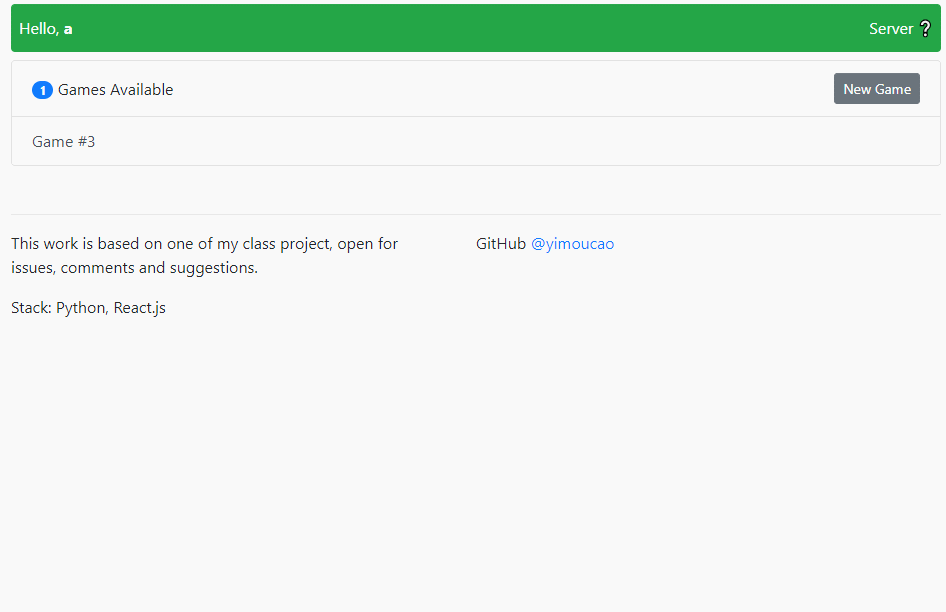

# Gomoku
Gomoku/GoBang/Five-in-a-Row. 1v1 gaming, also supports watching as audience

### Requirements
node.js 8.12.0

python>=3.4

aiohttp==3.4.4

### Basic usages

`cd` into the project folder

`npm install`

`python server/server.py`

`npm start`

### build front end files
`npm run build`

### Demo

